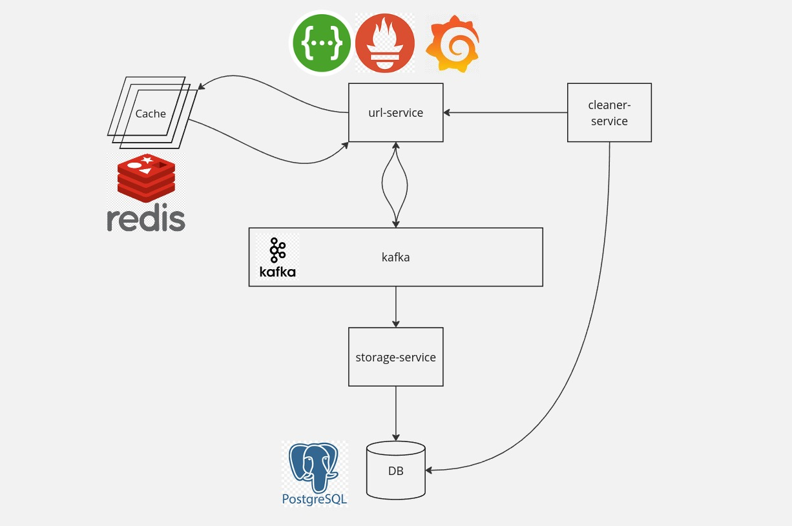

# url-shortener

В результате проектных работ ожидается:
1. Подробное архитектурное описание с тщательным анализом каждого принятого решения. Здесь будут освещены такие аспекты, как причины выделения функциональности в отдельный микросервис, выбор способа коммуникации – Kafka/GRPC, логика за выбором определённого типа базы данных, и другие ключевые моменты.
2. Полноценная реализация сервиса, отвечающая всем поставленным требованиям и стандартам качества. Не забудьте написать тесты для вашего проекта.
3. Docker compose файл, содержащий все необходимые настройки для быстрого и безболезненного запуска сервиса в любой среде.
4. Документация интерфейса сервиса, включающая в себя спецификацию REST запроса для генерации короткой ссылки и прочие важные детали взаимодействия с сервисом.

## Архитектурное описание
### Функциональные требования
- Для звданного URL, сервис генерирует уникальный сокращенный URL.
- При отправки GET запроса на сокращенный URL, происходит Redirect на оригинальный.
### Нефункциональные требования
- Сервис должен быть расширяемым и эффективным
- Надёжность, доступность
### Приблизительные оценки
- Операции записи: 1 миллион URL-адресов в день
- Операции записи в секунду: 1 милллион / 24 / 3600 = 12
- Операции чтения: 10 к 1, т. е. 120 операций чтения в секунду
- Пусть длина среднего URL составляет 100 символов, и среднее время жизни одной ссылки - 1 год, тогда \ 148 * 10^6 * 365 / 1024 / 1024 / 1024 = 50 ГБ \

### Архитектура сервиса

        ### Database Schema

